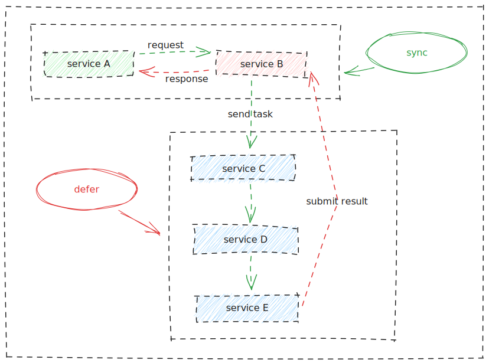

# SyncDefer   

[English](./README.md) | [简体中文](./README_CN.md)

A Node.js module for synchronous waiting execution proxy based on `LRUCache` and `Promise` to handle asynchronous processing across multiple services.

## Why?

Scenario: We have a service A that needs to make a synchronous request to service B. Service B needs to process this request by sending the task to service C. This task also needs to go through the processing of services D and E, and finally, service E will send the processed task result to service B. Once service B receives the processing result, it returns it to service A.

The problem that arises is: After service E submits the result to service B, **how can service B return the result to service A**?

Before solving the problem, let's break down the steps.

We divide this process into two steps, namely `sync` and `defer`. We mark the steps waiting for task processing as `defer` and the steps of sending task results as `sync`, as shown in the diagram:



The `sync-defer` module abstracts and encapsulates these two steps and make them independent.

The core design uses `LRUCache` to cache task IDs, allowing matching between sending requests and receiving results based on ID. It uses `Promise` to wait for processing and resolves or rejects the received results, thereby achieving synchronous waiting execution.

## Getting Started

### Install Dependencies

```sh
npm i sync-defer
```

### Dependency Import

```js
// for commonjs
const { SyncDefer } = require('sync-defer')
// for esm
import { SyncDefer } from 'sync-defer'
```

### new SyncDefer(options)

```js
const syncDefer = new SyncDefer({
  ttl: 500, // Cache expiration time in milliseconds, default is 5 minutes
  max: 10 // Maximum cache count, default is 500
})
```

### defer()

Wait for the result returned by the `sync` method.

```js
const result = await syncDefer.defer('id')
```

### sync()

Synchronize normal results:

```js
syncDefer.sync('id', { result: true })
```

Synchronize exceptional results:

```js
syncDefer.sync('id', null, new Error())
```

---

You can check the [test code](./test/index.test.ts) for a complete usage example.

## License

Released under the MIT License.
